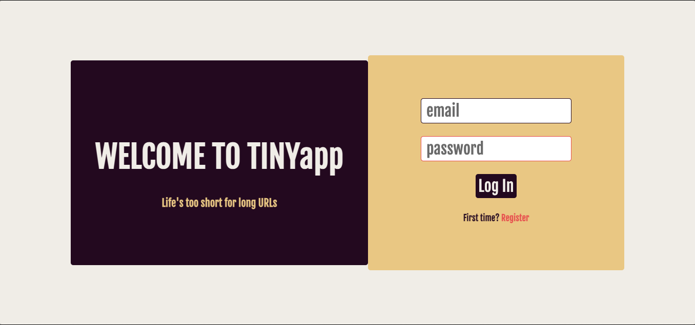
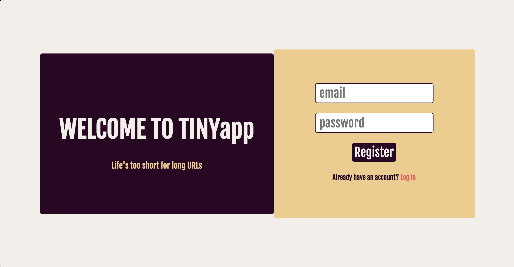
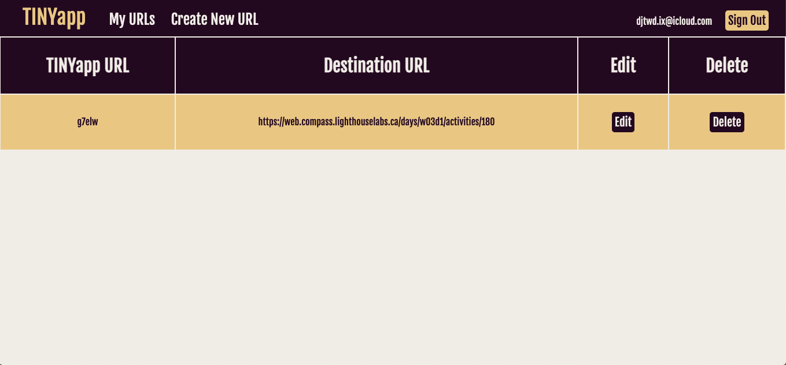
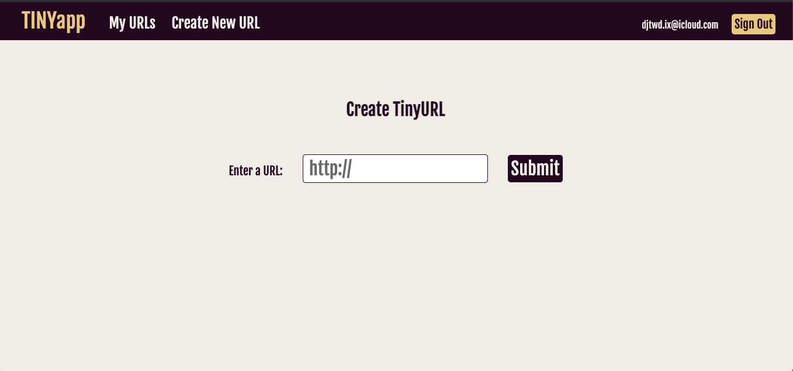
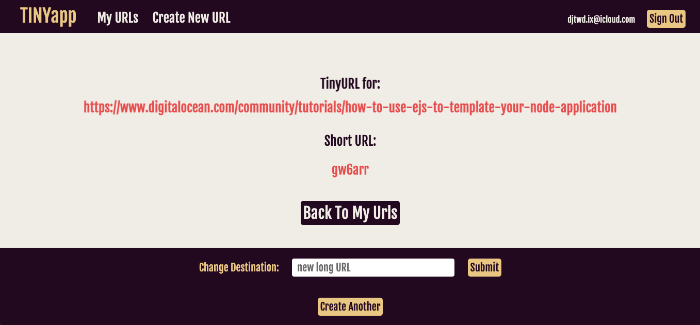

# Tiny App

A web app that allows users to sign up for an account and shorten URLs ala bit.ly.

## Final Product

## Dependencies

- Node.js
- Express
- bcrypt
- body-parser
- cookie-session

## Getting Started

- Install all dependencies using 'npm install'
- Run server using 'node express_server.js'
- Navigate to localhost port 8080